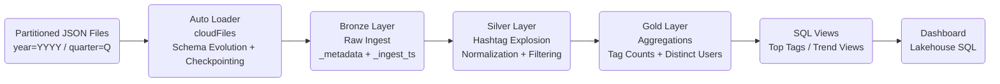

# Pinterest Streaming Lakehouse Pipeline (Databricks)

## Overview

This project implements an end-to-end streaming data pipeline using Databricks, Auto Loader, and Delta Lake.
It simulates incremental ingestion of partitioned JSON data and materializes Bronze, Silver, and Gold layers
for downstream analytics and dashboarding.

The focus of this project is architectural clarity, reliability, and production-style design decisions
rather than heavy infrastructure or large-scale cluster tuning.

---

## Architecture

This pipeline follows a Medallion (Bronze / Silver / Gold) pattern:

### Data Flow




**Bronze**
- Auto Loader ingests JSON files from a managed Volume (file arrival trigger).
- Captures metadata such as `_metadata.file_path`.
- Handles corrupt records and schema evolution.
- Writes raw data to a Delta table.

**Silver**
- Cleans and normalizes data.
- Converts string "null" values to proper nulls.
- Parses timestamps.
- Explodes hashtags into normalized tag records.
- Adds derived columns (post_year, post_quarter).
- Writes clean structured data to Delta.

**Gold**
- Aggregates tags by year and quarter.
- Computes:
  - tag_count
  - distinct_users
- Materializes analytics-ready Delta tables for dashboards.

---

## Key Technical Features

- Databricks Auto Loader (`cloudFiles`)
- Streaming ingestion with `availableNow=True`
- Delta Lake tables (Bronze/Silver/Gold)
- Unity Catalog compatibility
- Metadata-driven partition extraction
- Window functions for ranking
- Dashboard visualizations using Databricks SQL
- Partition-aware ingestion simulation
- Volume-based storage (no DBFS dependency)

---

## Data Flow

1. Partitioned JSON batches written to a Volume.
2. Auto Loader detects new files.
3. Bronze streaming ingestion appends to Delta.
4. Silver transformation notebook normalizes and explodes tags.
5. Gold aggregation computes metrics for dashboard consumption.
6. Databricks SQL dashboard queries Gold layer views.

---

## Design Decisions

- **Overwrite mode for Gold layer**: acceptable for demo scale; MERGE would be used in production.
- **Auto Loader chosen over batch read**: enables incremental file arrival simulation.
- **Schema evolution enabled**: supports future column additions.
- **Checkpointing enabled**: ensures idempotent streaming execution.
- **Volume storage used**: aligns with Unity Catalog best practices.

---

## Repository Structure

```
exploration/    # Early experiments and validation notebooks
pipeline/       # Bronze, Silver, Gold notebooks/scripts
dashboards/     # SQL queries for dashboard panels
docs/           # Notes and architectural references
```

Exploration artifacts are intentionally preserved to demonstrate iterative development
and validation of Auto Loader behavior and schema handling.

---

## How This Would Scale

In a production environment:
- Gold layer would use incremental MERGE logic.
- Data quality checks (e.g., Great Expectations) would be added.
- Orchestration would include retry policies and monitoring.
- Cluster autoscaling would handle larger ingestion volumes.

---

## Orchestration

The Bronze and Silver layers are orchestrated using a Databricks multi-task job:
- Task 1: File-triggered Auto Loader ingestion
- Task 2: Silver transformation
- Task 3: Gold aggregation

In production this would include retry policies, monitoring, and alerting.

---

## Technologies Used

- Databricks (Serverless)
- Apache Spark / PySpark
- Delta Lake
- Databricks SQL
- GitHub integration
- LLMs

---

## Purpose

This project demonstrates the ability to:
- Design and implement streaming Lakehouse pipelines
- Handle distributed data processing patterns
- Build production-style layered architectures
- Iterate rapidly while maintaining structural clarity

Created: 2026-02-13
